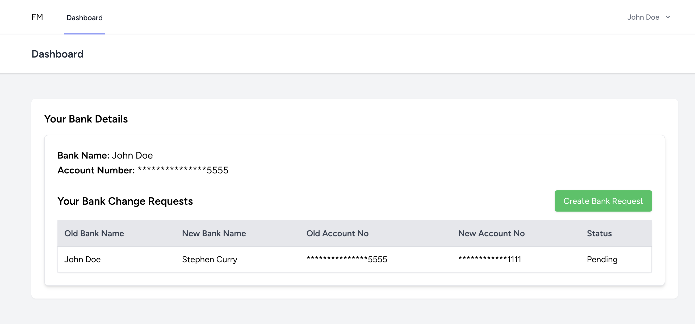
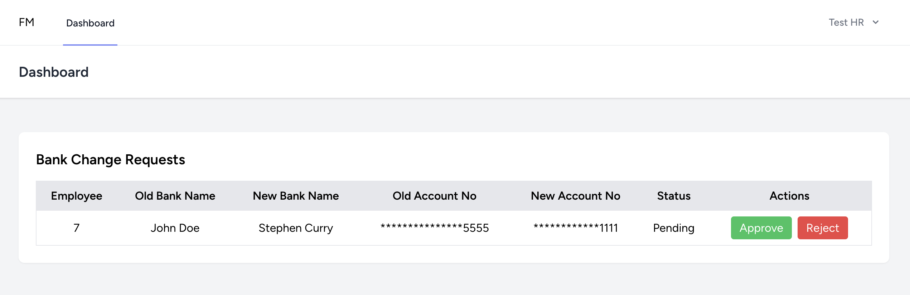

## Employee Screen

## HR Screen


# Payrol System (Bank Account Change Request)

This project provides a secure system for employees to request changes to their bank details while ensuring HR approval before updates take effect. It prioritizes security, data integrity, and ease of use.

## Features

- **Employee Bank Update Submission**: Employees submit a request to update their bank details.
- **Approval Process**: HR reviews and either approves or rejects the request.
- **Security Measures**: Encryption, input validation, and role-based access control.
- **Masking of Bank Details**: Sensitive details are masked for added security.
- **Policies & Services**: Uses policy-based access control and service layer separation.

## Table of Contents

- [Installation](#installation)
- [Prerequisites](#prerequisites)
- [Directory Structure](#directory-structure)
- [Features](#features)
- [Routes](#routes)
- [Testing](#testing)
- [License](#license)

## Installation

To set up this project locally, follow these steps:

### 1. Clone the repository

```bash
git clone https://github.com/codeyani/payroll-system.git
cd payroll-system
```

### 2. Install Dependencies

Ensure you have Composer installed. Then, run the following command to install the PHP dependencies:

```bash
composer install
```

```bash
npm install
```

### 3. Setup the environment

Create a .env file based on .env.example:

```bash
cp .env.example .env
```
Update the .env file with your database connection and other environment variables.

### 4. Migrate the database and run the seeder

Run the migration commands to set up the database schema:

```bash
php artisan migrate
```

Run the seed commands to insert all roles and permission (Employee and HR):

```bash
php artisan db:seed --class=RolePermissionSeeder
```

### 5. Start the development server

Run the application locally using Laravel's built-in server:

```bash
php artisan serve
```

```bash
npm run dev
```

By default, the application will be accessible at http://localhost:8000.

## Prerequisites

Ensure you have the following installed:

- PHP >= 8.2
- Composer
- MySQL or any other compatible database
- Laravel 10.x or later
- Node.js >= 16.x

## Directory Structure

The project is structured as follows:

```arduino
payrol-system/
│
├── app/
│   ├── Console/
│   ├── Exceptions/
│   ├── Http/
│   │   ├── Controllers/
│   │   │   ├── BankChangeRequestController.php
│   │   │   └──BankAccountController.php
│   │   ├── Resources/
│   │   │   ├── BankAccountResource.php
│   │   │   └── BankChangeRequestResource.php
│   ├── Models/
│   │   └── BankAccount.php
│   │   └── BankChangeRequest.php
│   │   └── BankApproval.php
│   ├── Services/
│   │   ├── Interfaces
│   │   │   ├── BankAccountServiceInterface.php
│   │   │   └── BankChangeRequestServiceInterface.php
│   │   ├── BankAccountService.php
│   │   └── BankChangeRequestService.php
│   └── Policies/
│       └── BankAccountPolicy.php
│       └── BankChangeRequestPolicy.php
├── database/
│   ├── migrations/
│   │   └── create_bank_accounts_table.php
│   │   └── create_bank_change_requests_and_bank_approvals_tables.php
│   │   └── create_permission_tables.php
│   │   └── create_users_tables.php
│   └── seeders/
│       └── RolePermissionSeeder.php
├── routes/
│   └── api.php
│   └── web.php
├── resources/
│   └── js
│       ├── Layouts
│       └── Pages
│           ├── Auth
│           ├── Employee
│           ├── HR
│           └── Profile
├── .env
├── .env.example
├── composer.json
└── phpunit.xml
```